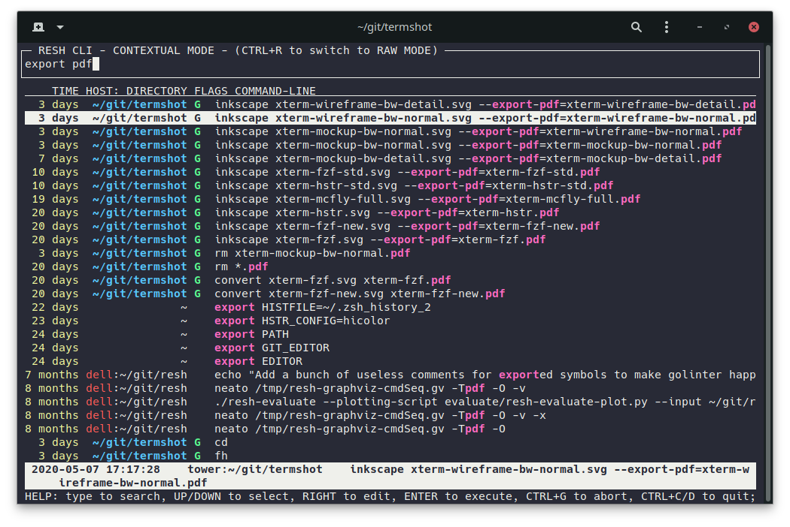

# Rich Enhanced Shell History

Context-based replacement/enhancement for zsh and bash shell history
<!-- Contextual shell history -->
<!-- Contextual bash history -->
<!-- Contextual zsh history -->
<!-- Context-based shell history -->
<!-- Context-based bash history -->
<!-- Context-based zsh history -->
<!-- Better shell history -->
<!-- Better bash history -->
<!-- Better zsh history -->
<!-- PWD Directory -->

**Search your history by commands or arguments and get relevant results based on current directory, git repo, exit status, and device.**

## Installation

### Prerequisites

Nohup

Standard stuff: `bash(4.3+)`, `curl`, `tar`, ...

MacOS: `coreutils` (`brew install coreutils`)

### Simplest installation

Run this command.

```sh
curl -fsSL https://raw.githubusercontent.com/curusarn/resh/master/scripts/rawinstall.sh | bash
```

### Simple installation

Run

```shell
git clone https://github.com/curusarn/resh.git
cd resh && scripts/rawinstall.sh
```

### Update

Check for updates and update

```sh
reshctl update
```

## Roadmap

[Overview of the features of the project](./roadmap.md)

## RESH SEARCH application

This is the most important part of this project.

RESH SEARCH app searches your history by commands. It uses device, directories, git remote, and exit status to show you relevant results first.

All this context is not in the regular shell history. RESH records shell history with context to use it when searching.

At first, the search application will look something like this. Some history with context and most of it without. As you can see, you can still search the history just fine.


Eventually most of your history will have context and RESH SEARCH app will get more useful.



Without a query, RESH SEARCH app shows you the latest history based on the current context (device, directory, git).


RESH SEARCH app replaces the standard reverse search - launch it using Ctrl+R.

Enable/disable the Ctrl+R keybinding:

```sh
reshctl enable ctrl_r_binding
reshctl disable ctrl_r_binding
```

### In-app key bindings

- Type to search/filter
- Up/Down or Ctrl+P/Ctrl+N to select results
- Right to paste selected command onto the command line so you can edit it before execution
- Enter to execute
- Ctrl+C/Ctrl+D to quit
- Ctrl+G to abort and paste the current query onto the command line
- Ctrl+R to switch between RAW and NORMAL mode

### View the recorded history

FIXME: redo/update this section

Resh history is saved to: `~/.resh_history.json`

Each line is a versioned JSON that represents one executed command line.

This is how I view it `tail -f ~/.resh_history.json | jq` or `jq < ~/.resh_history.json`.  

You can install `jq` using your favorite package manager or you can use other JSON parser to view the history.


*Recorded metadata will be reduced to only include useful information in the future.*

## Known issues

### Q: I use bash on macOS and resh doesn't work

**A:** Add line `[ -f ~/.bashrc ] && . ~/.bashrc` to your `~/.bash_profile`.

**Long Answer:** Under macOS bash shell only loads `~/.bash_profile` because every shell runs as login shell.

## Issues and ideas

Please do create issues if you encounter any problems or if you have suggestions: https://github.com/curusarn/resh/issues

## Uninstallation

You can uninstall this project at any time by running `rm -rf ~/.resh/`.

You won't lose any recorded history by removing `~/.resh` directory because history is saved in `~/.resh_history.json`.
